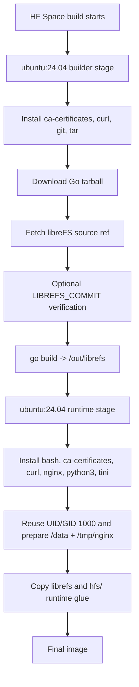
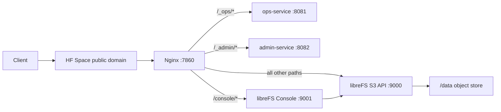

# 架构说明

LibreFS HFS 是 libreFS 的 Hugging Face Docker Space 部署包装层。包装层存在的核心原因是：Hugging Face Docker Space 只暴露一个外部 app port，而 libreFS 通常需要两个内部端口：

- `9000`：S3 API
- `9001`：Web Console

本项目用 Nginx 监听 `7860`，把外部单端口流量分发到 S3 API、Web Console、只读 ops-service 和默认关闭的 admin-service。

按本机 HFS 开发范式，本仓库是 Pattern A（HFS Port Repository）：仓库根目录仍是 Hugging Face Space root，同时也是 GitHub 维护 root；多服务 runtime glue 集中在 `hfs/` 下。

## 组件

| 组件 | 文件 | 职责 |
| --- | --- | --- |
| Docker build | `Dockerfile` | 安装 Go，拉取 libreFS 源码，编译 `librefs`，生成 runtime image。 |
| 启动脚本 | `hfs/start.sh` | 校验必需 Secrets，设置公开 URL 环境变量，启动 libreFS、ops-service、admin-service 和 Nginx，处理退出。 |
| 反向代理 | `hfs/nginx.conf` | 把公开 `7860` 流量分发到 ops、admin、Console 和 S3 API。 |
| 只读诊断 | `hfs/ops_service.py` | 提供 `/_ops/` dashboard，以及 `/_ops/health`、system、config、version 和 metrics API。 |
| 管理面 | `hfs/admin_service.py` | 默认关闭；开启后提供 status、action catalog、run-health-checks 和 reload-nginx。 |
| 数据目录 | `/data` | libreFS 对象数据和元数据目录。 |
| Space 元数据 | `README.md` | 声明 `sdk: docker`、`app_port: 7860` 等 HF Space 信息。 |

## 构建流程



这个流程明确不使用 libreFS 官方 Docker image。builder 和 runtime 都从 Ubuntu 开始，满足“原始镜像 + 源码构建”的部署要求。

## Runtime 进程模型

容器启动后，`tini` 执行 `hfs/start.sh`。

`hfs/start.sh` 的执行顺序：

1. 校验 `MINIO_ROOT_USER`。
2. 校验 `MINIO_ROOT_PASSWORD`。
3. 从 `PUBLIC_BASE_URL`、`SPACE_HOST` 或本地 fallback 推导公开根地址。
4. 设置 `MINIO_SERVER_URL`。
5. 设置 `MINIO_BROWSER_REDIRECT_URL=<public-base>/console/`。
6. 创建 `/data`、`/data/logs` 和 Nginx 临时目录。
7. 执行 `nginx -t` 校验配置。
8. 后台启动 `librefs server /data --address :9000 --console-address :9001`。
9. 后台启动 ops-service，监听 `127.0.0.1:8081`。
10. 后台启动 admin-service，监听 `127.0.0.1:8082`，默认 `ADMIN_ENABLED=false`。
11. 后台启动 Nginx，监听 `7860`。
12. 监控四个进程；任意一个退出时，终止其余进程并返回退出码。

## 请求流转



## 路由表

| 公开路径 | 上游服务 | 说明 |
| --- | --- | --- |
| `/_ops` | redirect to `/_ops/` | 统一 ops 路径。 |
| `/_ops/` | `http://127.0.0.1:8081/` | 只读诊断 dashboard 和 API 入口，需要 `OPS_TOKEN`。 |
| `/_ops/health` | `http://127.0.0.1:8081/health` | 只读 health API；外部路径必须带 `/_ops/` 前缀。 |
| `/_ops/system` | `http://127.0.0.1:8081/system` | 只读 system API；外部路径必须带 `/_ops/` 前缀。 |
| `/_ops/config` | `http://127.0.0.1:8081/config` | 只读 config API，只返回 Secret presence。 |
| `/_ops/version` | `http://127.0.0.1:8081/version` | 只读 version API。 |
| `/_ops/metrics` | `http://127.0.0.1:8081/metrics` | Prometheus metrics，仍需要 ops token。 |
| `/_admin` | redirect to `/_admin/` | 统一 admin 路径。 |
| `/_admin/` | `http://127.0.0.1:8082/` | 默认关闭的管理入口，需要 `ADMIN_ENABLED=true` 和 `ADMIN_TOKEN`。 |
| `/console` | redirect to `/console/` | 统一 Console 路径。 |
| `/console/` | `http://127.0.0.1:9001/` | Nginx 会剥掉 `/console/` 前缀后再转发。 |
| `/console/static/...` | `http://127.0.0.1:9001/static/...` | Console JS/CSS 资源路径。 |
| `/minio/health/ready` | `http://127.0.0.1:9000/minio/health/ready` | Docker `HEALTHCHECK` 和外部 smoke test。 |
| `/<bucket>/<object>` | `http://127.0.0.1:9000/<bucket>/<object>` | S3 path-style 对象 URL。 |

`proxy_pass http://127.0.0.1:9001/;` 末尾的 `/` 是必需的。它会让 Nginx 剥掉 `/console/` 前缀。没有这个 `/` 时，Console 的 JS/CSS 请求会被上游当成 HTML fallback，浏览器会因为 MIME type 错误拒绝加载。

`/_ops/` 和 `/_admin/` 必须排在 `location /` 前面，否则 S3 API 根路径会接管这些保留路径。不要创建名为 `_ops` 或 `_admin` 的 bucket。

Nginx 会把 `/_ops/` 前缀剥掉再转发给 ops-service，所以内部 handler 看到的是 `/health`、`/system`、`/config`、`/version` 和 `/metrics`。这些短路径不是外部公开 URL；用户文档、脚本和面板链接都必须使用 `/_ops/...`。

## URL 环境变量

libreFS 继承 MinIO-compatible 环境变量：

| 变量 | 本项目中的值 | 用途 |
| --- | --- | --- |
| `MINIO_SERVER_URL` | 公开根地址，不带末尾 `/` | 让 S3 URL 和 redirect 使用 HF Space 公开域名。 |
| `MINIO_BROWSER_REDIRECT_URL` | `<public-base>/console/` | 让 Console 知道自己挂在 `/console/` 子路径下。 |

当 `MINIO_BROWSER_REDIRECT_URL` 带 path 时，libreFS 会把这个 path 传给内置 Console 作为 `CONSOLE_SUBPATH`。
为避免覆盖值破坏单端口路由契约，`hfs/start.sh` 会拒绝缺少 `http://` 或 `https://` scheme 的 `MINIO_SERVER_URL`，也会拒绝不以 `/console/` 结尾的 `MINIO_BROWSER_REDIRECT_URL`。

## 数据目录

libreFS 将对象数据和元数据写到：

```text
/data
```

如果没有挂载 Hugging Face Storage Bucket，`/data` 是容器本地临时目录。它适合短期测试和临时文件共享，但不保证持久。

当前 `hf spaces volumes list` 显示已经把 `BlueSkyXN/libreFS-HFS-storage` 挂载到 `/data`。挂载只证明路径具备持久化条件；仍需要重新做“上传对象 -> 重启 Space -> 读取对象 -> rebuild 后再次读取”的持久化验收。

## 安全模型

S3 API 是公网可访问的，但默认需要 S3 签名认证。root 凭证来自：

- `MINIO_ROOT_USER`
- `MINIO_ROOT_PASSWORD`

Web Console 也是公网可访问，但需要登录。

`/_ops/` 是只读诊断面，使用 `OPS_TOKEN` 保护。它可以返回 dashboard、health、system、config、version 和 metrics，但 `/_ops/config` 只返回 secret 是否存在，不返回 secret 原文。不要把写操作、任意命令、SQL、文件读取或重启能力放进 `/_ops`。

ops 脚本访问应使用 `X-Ops-Token` 或 `Authorization: Bearer <token>`。浏览器首次进入可临时使用 `/_ops/?token=<ops-token>` 或登录表单；验证成功后服务设置 `Secure; HttpOnly; SameSite=Lax; Path=/_ops` cookie，并跳转到不带 token 的 URL。`?token=` 不应长期出现在文档、日志、截图或分享链接中。

`/_admin/` 是独立管理面，代码默认 `ADMIN_ENABLED=false`。开启时必须设置 `ADMIN_TOKEN`，通过独立 header 或 bearer token 鉴权；代码不强制 `ADMIN_TOKEN` 和 `OPS_TOKEN` 的值不同。当前生产环境已显式设置 `ADMIN_ENABLED=true`。当前白名单 action 只有 `run-health-checks` 和 `reload-nginx`，其中 `reload-nginx` 需要 `confirm=true` 并写入 `/data/logs/admin-audit.jsonl`。当前版本不提供 Web terminal、file manager、bucket/policy/root credential 管理或 `librefs` restart。

ops/admin JSON 支持 `en` 和 `zh-CN` 文案。`error`、endpoint path 和 action `name` 保持机器可读稳定值；`message`、`hint`、`label`、`description`、`risk` 和 `notes` 按 `?lang=`、`X-Control-Language`、`Accept-Language` 或 `CONTROL_PLANE_DEFAULT_LANG` 返回对应语言，避免管理界面误读危险操作。

匿名 HTTP 直链默认不可访问。只有 bucket policy 显式允许匿名 `s3:GetObject` 后，公开直链才会返回对象内容。

Console 代理层会隐藏 upstream `X-Frame-Options`，并补充允许 Hugging Face 页面嵌入的 `Content-Security-Policy frame-ancestors`。这是为了让 Space 项目页里的 iframe 能正常展示 Console；直接访问 `https://blueskyxn-librefs-hfs.hf.space/console/` 时仍然需要 Console 登录。
