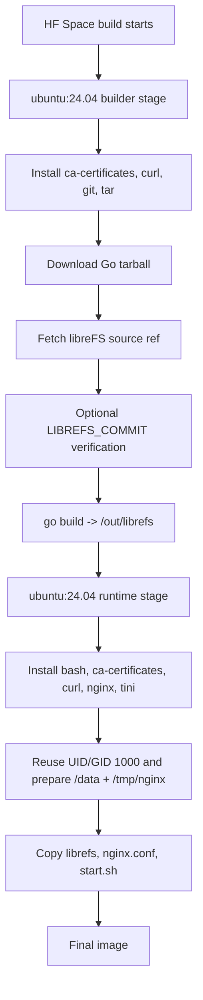
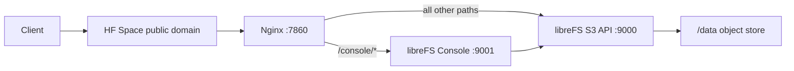

# 架构说明

LibreFS HFS 是 libreFS 的 Hugging Face Docker Space 部署包装层。包装层存在的核心原因是：Hugging Face Docker Space 只暴露一个外部 app port，而 libreFS 通常需要两个内部端口：

- `9000`：S3 API
- `9001`：Web Console

本项目用 Nginx 监听 `7860`，把外部单端口流量分发到这两个内部服务。

## 组件

| 组件 | 文件 | 职责 |
| --- | --- | --- |
| Docker build | `Dockerfile` | 安装 Go，拉取 libreFS 源码，编译 `librefs`，生成 runtime image。 |
| 启动脚本 | `start.sh` | 校验必需 Secrets，设置公开 URL 环境变量，启动 libreFS 和 Nginx，处理退出。 |
| 反向代理 | `nginx.conf` | 把公开 `7860` 流量分发到 S3 API 和 Console。 |
| 数据目录 | `/data` | libreFS 对象数据和元数据目录。 |
| Space 元数据 | `README.md` | 声明 `sdk: docker`、`app_port: 7860` 等 HF Space 信息。 |

## 构建流程



这个流程明确不使用 libreFS 官方 Docker image。builder 和 runtime 都从 Ubuntu 开始，满足“原始镜像 + 源码构建”的部署要求。

## Runtime 进程模型

容器启动后，`tini` 执行 `start.sh`。

`start.sh` 的执行顺序：

1. 校验 `MINIO_ROOT_USER`。
2. 校验 `MINIO_ROOT_PASSWORD`。
3. 从 `PUBLIC_BASE_URL`、`SPACE_HOST` 或本地 fallback 推导公开根地址。
4. 设置 `MINIO_SERVER_URL`。
5. 设置 `MINIO_BROWSER_REDIRECT_URL=<public-base>/console/`。
6. 创建 `/data` 和 Nginx 临时目录。
7. 执行 `nginx -t` 校验配置。
8. 后台启动 `librefs server /data --address :9000 --console-address :9001`。
9. 后台启动 Nginx，监听 `7860`。
10. 监控两个进程；任意一个退出时，终止另一个并返回退出码。

## 请求流转



## 路由表

| 公开路径 | 上游服务 | 说明 |
| --- | --- | --- |
| `/console` | redirect to `/console/` | 统一 Console 路径。 |
| `/console/` | `http://127.0.0.1:9001/` | Nginx 会剥掉 `/console/` 前缀后再转发。 |
| `/console/static/...` | `http://127.0.0.1:9001/static/...` | Console JS/CSS 资源路径。 |
| `/minio/health/ready` | `http://127.0.0.1:9000/minio/health/ready` | Docker `HEALTHCHECK` 和外部 smoke test。 |
| `/<bucket>/<object>` | `http://127.0.0.1:9000/<bucket>/<object>` | S3 path-style 对象 URL。 |

`proxy_pass http://127.0.0.1:9001/;` 末尾的 `/` 是必需的。它会让 Nginx 剥掉 `/console/` 前缀。没有这个 `/` 时，Console 的 JS/CSS 请求会被上游当成 HTML fallback，浏览器会因为 MIME type 错误拒绝加载。

## URL 环境变量

libreFS 继承 MinIO-compatible 环境变量：

| 变量 | 本项目中的值 | 用途 |
| --- | --- | --- |
| `MINIO_SERVER_URL` | 公开根地址，不带末尾 `/` | 让 S3 URL 和 redirect 使用 HF Space 公开域名。 |
| `MINIO_BROWSER_REDIRECT_URL` | `<public-base>/console/` | 让 Console 知道自己挂在 `/console/` 子路径下。 |

当 `MINIO_BROWSER_REDIRECT_URL` 带 path 时，libreFS 会把这个 path 传给内置 Console 作为 `CONSOLE_SUBPATH`。
为避免覆盖值破坏单端口路由契约，`start.sh` 会拒绝缺少 `http://` 或 `https://` scheme 的 `MINIO_SERVER_URL`，也会拒绝不以 `/console/` 结尾的 `MINIO_BROWSER_REDIRECT_URL`。

## 数据目录

libreFS 将对象数据和元数据写到：

```text
/data
```

如果没有挂载 Hugging Face Storage Bucket，`/data` 是容器本地临时目录。它适合短期测试和临时文件共享，但不保证持久。

当前 `hf spaces volumes list` 显示已经把 `BlueSkyXN/libreFS-HFS-storage` 挂载到 `/data`。挂载只证明路径具备持久化条件；仍需要重新做“上传对象 -> 重启 Space -> 读取对象 -> rebuild 后再次读取”的持久化验收。

## 安全模型

S3 API 是公网可访问的，但默认需要 S3 签名认证。root 凭证来自：

- `MINIO_ROOT_USER`
- `MINIO_ROOT_PASSWORD`

Web Console 也是公网可访问，但需要登录。

匿名 HTTP 直链默认不可访问。只有 bucket policy 显式允许匿名 `s3:GetObject` 后，公开直链才会返回对象内容。

Console 代理层会隐藏 upstream `X-Frame-Options`，并补充允许 Hugging Face 页面嵌入的 `Content-Security-Policy frame-ancestors`。这是为了让 Space 项目页里的 iframe 能正常展示 Console；直接访问 `https://blueskyxn-librefs-hfs.hf.space/console/` 时仍然需要 Console 登录。
